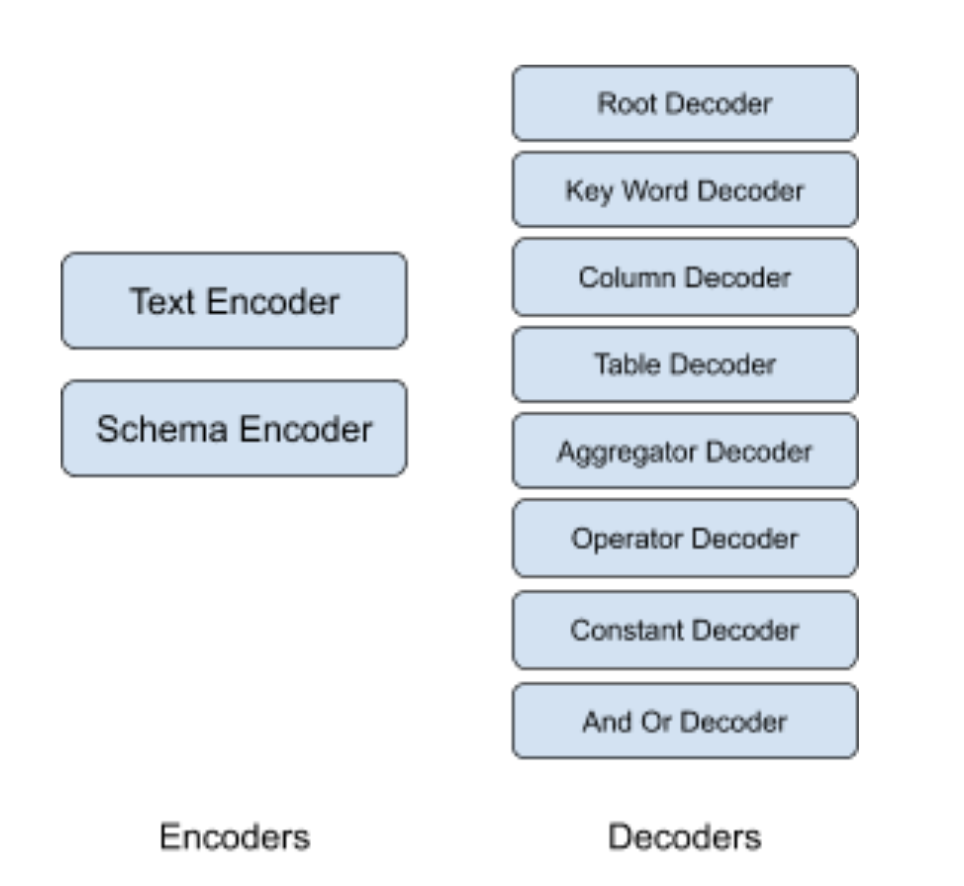
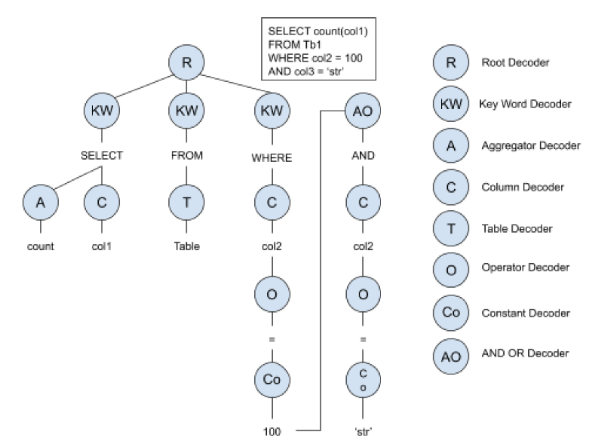

# seq2sql

Given a natural language question posed to retrieve information from a large database, the task is to translate this question to an equivalent SQL query, such that the execution of that query provides the user with the desired results. We have focussed our work on implementing a model that generalizes well for unseen data by limiting the problem to simple queries.

 
This method, like our previous approaches, uses an encoder decoder architecture for the given task. There are multiple encoders and decoders used, which have the same model, but differ only because the input they get and the order in which they are called.

Encodes and Decoders

4.3.1 Encoders

The encoders encode all the input to the network and pass the encodings to the decoders. 
The encoding part is done by two encoders:

Text Encoder: This encoder encodes the word vectors for the english text.

Schema Encoder: This encoder is responsible for encoding the schema information of the database. We have used just the table names and column names from the schema information given in the WikiSQL dataset.  

4.3.2 Decoders

The decoders receive all the encoding from the encoders. The decoding part is recursive, i.e. the decoder contains a call to itself. In terms of machine translation done in our previous approach, each of the RNN cell is a decoder in this method and is responsible for predicting a specific part of the SQL query.,  The decoding part is done by eight decoders (Figure 4):

Root Decoder: This decoder is the one which is called first. It is not responsible for predicting any part of the sql query, but only calling the keyword decoder. 

Keyword Decoder:  This decoder is responsible for predicting the keyword in the SQL languages. Since the WikiSQL dataset has limited keywords, this decoder predicts one of SELECT, FROM and WHERE. For a bigger dataset, this decoder should also be responsible for predicting other keywords like GROUP BY and HAVING. It can call the aggregator decoder, column decoder or the Table Decoder.

Column Decoder: This decoder predicts the column name in the SQL query. The vocab of this decoder is all the column names present in the schema. It can call the Operator Decoder. 

Table Decoder: Similar to the previous decoder, this one predicts the table name and has the vocab of all the table names from the schema. It does not call any decoder.

Aggregator Decoder: This decoder predicts the aggregator for columns. It can be one of COUNT, SUM, MAX, MIN and AVG. It does not call other decoders.

Operator Decoder: It predicts the operator in the ‘where’ section of the query. It can predict one of =, !=, >, >=, <, <=, like etc. It calls the Constant Decoder after it.

Constant Decoder: The where part of the query can have constants with whom the column values are compared to. These constants can be numbers or strings. The output vocab of this decoder is the entire input vocab size of our text encoder because the constant can literally be anything. It can call the And Or Decoder 

And Or Decoder: This decoder predicts the keywords ‘AND’ and ‘OR’ in the where part of the SQL query. It calls the Column Decoder after it.

The figure below shows the decoding procedure. Consider the example query given in it. First the root decoder will be called. It will intern call the keyword decoder and this procedure goes on until the terminating condition is encountered. The training done is teacher forced, so the next decoder will have the right answer from the previous decoder. 

Decoding process
